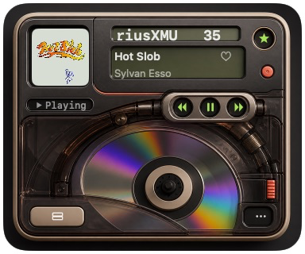
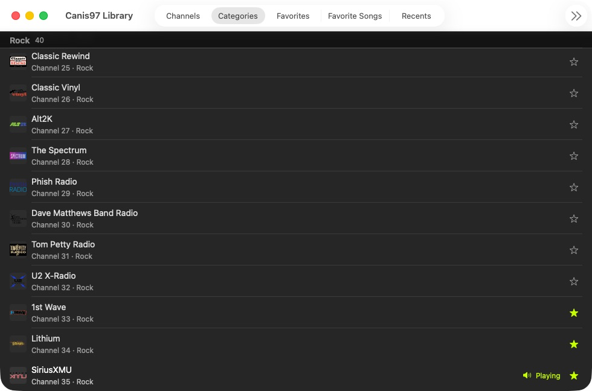

# Canis97

[](https://github.com/gabeosx/canis97/actions/workflows/ci.yml)
[](https://github.com/gabeosx/canis97/releases/latest)
[](https://github.com/gabeosx/canis97)

Canis97 (pronounced “CAN-iss nine-seven”) is a native SiriusXM player for macOS. It brings live radio, channel browsing, favorites, media keys, and a compact skinnable player together in one proper Mac app.

> [!IMPORTANT]
> Canis97 is an independent, unofficial project. It is not affiliated with, endorsed by, or sponsored by Sirius XM Radio LLC. A current SiriusXM subscription is required, and upstream compatibility can change without notice.

<table>
  <tr>
    <td width="44%" valign="top"></td>
    <td width="56%" valign="top"></td>
  </tr>
</table>

## Features

- Browse and search the live channels included with your subscription.
- Keep favorite channels, recent stations, and songs you want to revisit close at hand.
- See live artwork and program or song information in a compact always-on-top player.
- Control playback with the app, Mac media keys, or Control Center.
- Switch between bundled appearances or import a `.canis97skin` theme.
- Check GitHub Releases for updates from inside the app.
- See which integration stage needs attention and review a privacy-safe support bundle before exporting it.
- Restore sign-in securely with macOS Keychain.

## Requirements

- macOS 26 or later
- Apple silicon Mac
- Active SiriusXM subscription

## Installation

### GitHub Releases

Download the latest signed build from [GitHub Releases](https://github.com/gabeosx/canis97/releases), unzip it, and move **Canis97.app** to your Applications folder.

The first public binary has not been published yet. Until then, build Canis97 from source.

### Homebrew

Homebrew installation will be available with the first public release.

### Build from source

```sh
git clone https://github.com/gabeosx/canis97.git
cd canis97
open SiriusMac.xcodeproj
```

Select the `Canis97` scheme and build for **My Mac**. Building from source requires Xcode 26.6 and Swift 6.3.

## Getting started

1. Launch Canis97 and choose **Sign In with SiriusXM**.
2. Complete sign-in in the app’s nonpersistent SiriusXM browser surface.
3. Open the Library and refresh your channels.
4. Double-click a channel—or select it and choose **Tune**—to start listening.
5. Choose an appearance in **Settings**, or import a local `.canis97skin` theme.

## Privacy and account safety

Credentials and session tokens are stored in macOS Keychain and sent only to SiriusXM. Canis97 excludes passwords, cookies, authorization headers, session identifiers, stream URLs, and raw provider responses from diagnostics.

Choose **Help > Compatibility & Support…** to see the current authentication, entitlement, catalog, stream, metadata, and playback classifications. The optional JSON support bundle contains only the app/OS versions, architecture, and the six classifications shown in its on-screen preview.

Canis97 does not bypass CAPTCHA, MFA, subscription or device limits, anti-bot controls, DRM, or other service protections.

## Development

The SiriusXM integration lives in the reusable `SiriusXMClient` Swift package. Run the package tests and compile the app test bundle with:

```sh
swift test --package-path Packages/SiriusXMClient

xcodebuild build-for-testing \
  -project SiriusMac.xcodeproj \
  -scheme Canis97 \
  -destination 'platform=macOS' \
  -only-testing:Canis97Tests \
  -parallel-testing-enabled NO \
  CODE_SIGNING_ALLOWED=NO
```

CI runs these checks for pull requests and changes to `main`.

## Releases and versioning

Canis97 uses Semantic Versioning and `vMAJOR.MINOR.PATCH` release tags. GitHub Releases is the canonical download source, and the Homebrew Cask uses the same signed and notarized build. See [RELEASING.md](RELEASING.md) for the release process and [CHANGELOG.md](CHANGELOG.md) for release notes.

## Contributing

Issues and pull requests are welcome. Never include credentials, cookies, stream URLs, authenticated responses, or subscriber data in bug reports or test fixtures.

## Legal

Canis97 is an independent app and is not affiliated with, endorsed by, or sponsored by Sirius XM Radio LLC. SiriusXM names and marks belong to their respective owners.

Canis97 is available under the [MIT License](LICENSE).
