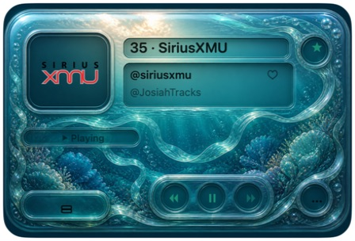
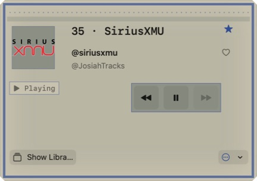
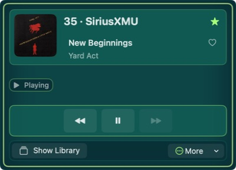
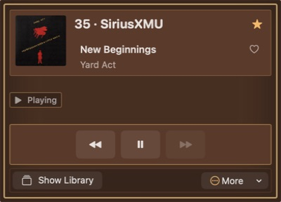

<div align="center">

# Canis97

### SiriusXM, built like a real Mac app.

Live radio, media keys, favorites, and a tiny skinnable player—without living in a browser tab.

[](https://github.com/gabeosx/canis97/actions/workflows/ci.yml)
[](https://github.com/gabeosx/canis97/releases/latest)
[](https://github.com/gabeosx/canis97)
[](LICENSE)

</div>

> [!IMPORTANT]
> Canis97 is an independent, unofficial project. It is not affiliated with, endorsed by, or sponsored by Sirius XM Radio LLC. A current SiriusXM subscription is required, and upstream compatibility can change without notice.

<table>
  <tr>
    <td width="40%" align="center" valign="middle">
      
    </td>
    <td width="60%" align="center" valign="middle">
      
    </td>
  </tr>
  <tr>
    <td align="center"><strong>Pocket Disc</strong><br><sub>A compact player that stays out of the way.</sub></td>
    <td align="center"><strong>Native channel library</strong><br><sub>Browse, search, favorite, and tune without leaving macOS.</sub></td>
  </tr>
</table>

## What it does

- Plays the live channels included with your SiriusXM subscription.
- Browses channels by list, category, favorites, favorite songs, and recents.
- Shows current artwork, program or song metadata, and playback state.
- Works with Mac media keys, Control Center, keyboard shortcuts, and an always-on-top player.
- Restores sign-in securely from macOS Keychain.
- Checks GitHub Releases for updates without silently downloading or installing anything.
- Reports authentication, catalog, stream, metadata, and playback compatibility without exposing subscriber data.

## Pick a look

Canis97 ships with five bundled appearances plus Native and supports safe, declarative `.canis97skin` packages. A skin can change color, spacing, shape, typography, fixed layout, and local decorative images—but it cannot run code or alter playback behavior.

<table>
  <tr>
    <td width="50%" align="center" valign="top">
      <br>
      <strong>Aqua Vista</strong>
    </td>
    <td width="50%" align="center" valign="top">
      <br>
      <strong>Pixel Desk</strong>
    </td>
  </tr>
  <tr>
    <td width="50%" align="center" valign="top">
      <br>
      <strong>Signal Glow</strong>
    </td>
    <td width="50%" align="center" valign="top">
      <br>
      <strong>Tape Deck</strong>
    </td>
  </tr>
</table>

Want your own? Follow [Creating a Canis97 skin](docs/skins/creating-a-skin.md), or ask Codex:

```text
Use $skill-installer to install https://github.com/gabeosx/canis97/tree/main/.agents/skills/canis97-skin-creator
```

Then invoke `$canis97-skin-creator` with the look you want.

## Install

Canis97 requires macOS 26 or later, an Apple silicon Mac, and an active SiriusXM subscription.

### GitHub Releases

Download the latest signed build from [GitHub Releases](https://github.com/gabeosx/canis97/releases), unzip it, and move **Canis97.app** to Applications.

### Homebrew

Install the same signed release from the project-owned tap:

```sh
brew tap gabeosx/tap
brew install --cask canis97
```

Later releases can be installed with `brew upgrade --cask canis97`.

### Build from source

```sh
git clone https://github.com/gabeosx/canis97.git
cd canis97
open SiriusMac.xcodeproj
```

Select the `Canis97` scheme and build for **My Mac**. Source builds require Xcode 26.6 and Swift 6.3.

## Start listening

1. Launch Canis97 and choose **Sign In with SiriusXM**.
2. Complete sign-in in the app’s nonpersistent SiriusXM browser.
3. Open the Library and refresh your channels.
4. Double-click a channel—or select it and choose **Tune**—to start listening.
5. Choose an appearance from **Player → Appearance**, or manage imported skins in **Settings**.

## Privacy and account safety

Credentials and session tokens are stored in macOS Keychain and sent only to SiriusXM. Canis97 excludes passwords, cookies, authorization headers, session identifiers, stream URLs, and raw provider responses from diagnostics.

Choose **Help → Compatibility & Support…** to see the current authentication, entitlement, catalog, stream, metadata, and playback classifications. The optional JSON support bundle contains only the app and OS versions, architecture, and the six classifications shown in its on-screen preview.

Canis97 does not bypass CAPTCHA, MFA, subscription or device limits, anti-bot controls, DRM, or other service protections.

## Develop

The SiriusXM integration lives in the reusable `SiriusXMClient` Swift package. Run the package tests and compile the app test bundle with:

```sh
swift test --package-path Packages/SiriusXMClient

xcodebuild build-for-testing \
  -project SiriusMac.xcodeproj \
  -scheme Canis97 \
  -destination 'platform=macOS' \
  -only-testing:Canis97Tests \
  -parallel-testing-enabled NO \
  CODE_SIGNING_ALLOWED=NO
```

CI runs these checks for pull requests and changes to `main`. Start with the [documentation index](docs/README.md) for skin, client, and release references.

## Releases and versioning

Canis97 follows Semantic Versioning with `vMAJOR.MINOR.PATCH` release tags. GitHub Releases is the canonical channel; the Homebrew Cask points to the same Apple-signed and notarized archive. See [RELEASING.md](RELEASING.md) and [CHANGELOG.md](CHANGELOG.md).

## Contributing

Issues and pull requests are welcome. Never include credentials, cookies, stream URLs, authenticated responses, or subscriber data in bug reports or fixtures.

## Legal

Canis97 is an independent app and is not affiliated with, endorsed by, or sponsored by Sirius XM Radio LLC. SiriusXM names and marks belong to their respective owners.

Canis97 is available under the [MIT License](LICENSE).
