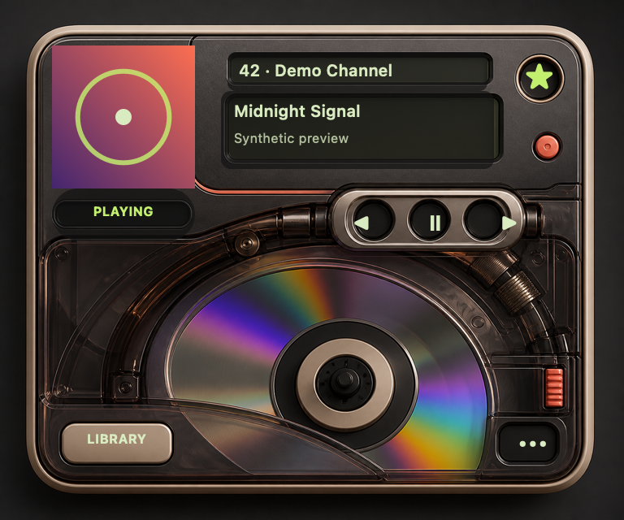
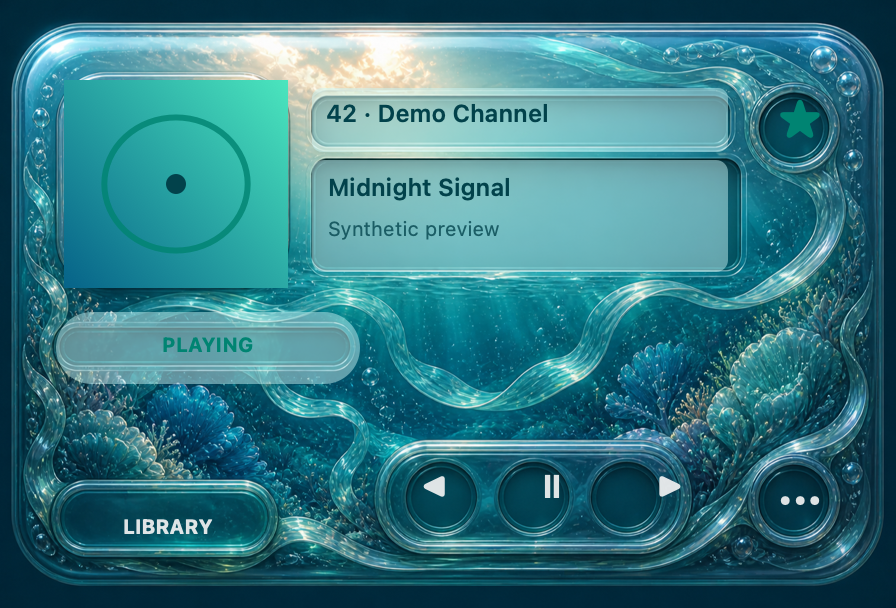

# Canis97

[](https://github.com/gabeosx/canis97/actions/workflows/ci.yml)
[](https://github.com/gabeosx/canis97/releases/latest)
[](https://github.com/gabeosx/canis97)

Canis97 (pronounced “CAN-iss nine-seven”) is a compact, native macOS player for SiriusXM subscribers. It pairs a dependable live-radio library with a playful, skinnable player inspired by the spirit of turn-of-the-century desktop music apps—without wrapping the SiriusXM website.

> [!IMPORTANT]
> Canis97 is an independent, unofficial project. It is not affiliated with, endorsed by, or sponsored by Sirius XM Radio LLC. A current SiriusXM subscription is required, and upstream compatibility can change without notice.

## Screenshots

These static previews use the app’s real bundled faceplates and synthetic channel metadata. No subscriber session or live SiriusXM content was captured.

<table>
  <tr>
    <td width="50%"></td>
    <td width="50%"></td>
  </tr>
  <tr>
    <td align="center"><strong>Pocket Disc</strong></td>
    <td align="center"><strong>Aqua Vista</strong></td>
  </tr>
</table>

## Highlights

- Native SwiftUI and AppKit experience built for the current macOS release.
- Live entitled-channel browsing, search, favorites, recents, and playback queue navigation.
- Compact always-on-top player with artwork, current program or song metadata, and clear playback state.
- macOS media keys and Control Center integration for play, pause, previous, and next.
- Local Favorite Songs list for keeping track of music you want to revisit elsewhere.
- Bundled appearances plus validated, declarative `.canis97skin` packages with no executable scripts.
- Keychain-backed sign-in restoration, ephemeral stream URLs, privacy-aware diagnostics, and explicit sign-out cleanup.
- Manual and daily update checks against the canonical GitHub Releases feed; updates are never installed silently.

## Status and requirements

Canis97 is preparing its first public `0.1.0` release. The source tree is usable for development, but there is not yet a signed public binary.

- macOS 26 or newer
- Apple silicon Mac for the initial binary release
- Active SiriusXM subscriber account
- Xcode 26.6 and Swift 6.3 to build from source

Canis97 does not bypass CAPTCHA, MFA, subscription or device limits, anti-bot controls, DRM, or other service protections. When an upstream flow is unknown or unsupported, the app stops and reports that state.

## Installation

### GitHub Releases

Signed, notarized Apple-silicon archives will be published on the [Releases page](https://github.com/gabeosx/canis97/releases). Each release includes SHA-256 checksums and an SPDX software bill of materials.

### Homebrew

A `canis97` Homebrew Cask is generated from the same immutable GitHub release. The tap and exact install command will be added here with the first signed release, after clean-machine Gatekeeper and Cask verification pass.

### Build from source

```sh
git clone https://github.com/gabeosx/canis97.git
cd canis97
open SiriusMac.xcodeproj
```

Select the `Canis97` scheme and build for **My Mac**. Development builds intentionally have no update feed configured.

## Using Canis97

1. Launch Canis97 and choose **Sign In with SiriusXM**.
2. Complete sign-in in the app’s nonpersistent SiriusXM browser surface.
3. Open the Library, refresh your entitled channels, and double-click or choose **Tune**.
4. Use the compact player, menu commands, media keys, or Control Center to manage playback.
5. Choose an appearance in **Settings**, or import a validated local `.canis97skin` package.

Credentials and session tokens stay on your Mac except when sent directly to SiriusXM. Passwords, cookies, authorization headers, session identifiers, stream URLs, and raw provider responses are excluded from app diagnostics.

## Project structure

```text
Canis97 app
├── SwiftUI/AppKit windows, playback, library, skins, and Keychain storage
└── SiriusXMClient
    └── Reusable SwiftPM library for authentication, catalog, metadata, and streams
```

The `SiriusXMClient` package isolates volatile provider behavior behind typed public APIs so compatibility repairs do not spread into the player UI. Views never make SiriusXM requests directly.

## Development

The narrow, non-launching validation path is:

```sh
swift test --package-path Packages/SiriusXMClient

xcodebuild build-for-testing \
  -project SiriusMac.xcodeproj \
  -scheme Canis97 \
  -destination 'platform=macOS' \
  -only-testing:Canis97Tests \
  -parallel-testing-enabled NO \
  CODE_SIGNING_ALLOWED=NO
```

CI runs those checks on pull requests and `main`. Live provider checks are deliberately separate, serialized, owner-authorized operations.

To regenerate the synthetic README screenshots without launching Canis97:

```sh
swift script/render_readme_previews.swift
```

## Releases and versioning

Canis97 follows stable Semantic Versioning with immutable `vMAJOR.MINOR.PATCH` tags. GitHub Releases is the canonical binary channel; the Homebrew Cask always points to the matching signed and notarized archive. See [RELEASING.md](RELEASING.md) for the complete signing, notarization, checksum, SBOM, and rollback process, and [CHANGELOG.md](CHANGELOG.md) for user-facing changes.

## Contributing

Issues and focused pull requests are welcome. Please keep provider-specific behavior inside `SiriusXMClient`, add deterministic tests for compatibility changes, and never include credentials, cookies, stream URLs, raw authenticated responses, or subscriber data in reports and fixtures.

For security-sensitive findings, avoid opening an issue containing secrets or account data. Provide only redacted reproduction details.

## Legal

Canis97 is an independent app and is not affiliated with, endorsed by, or sponsored by Sirius XM Radio LLC. SiriusXM names and marks belong to their respective owners.
